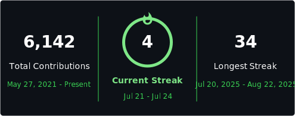

<!--
  Self-hosted profile cards live in ./assets and refresh via
  .github/workflows/profile-readme.yml (daily cron + workflow_dispatch).

  One-time setup: create a classic PAT (repo + read:user), add it as the
  repository secret PROFILE_README_TOKEN, then run the workflow once.
-->

[Resume](https://drive.google.com/file/d/1v_5cNRZkcjzyMF1HlNdHI6A0jLxrcI-B/view?usp=sharing)
·
[X / Twitter](https://x.com/durgeshbg)

---

### activity

  
  

### stack

  

  <picture>
    <source media="(prefers-color-scheme: dark)" srcset="./assets/snake-dark.svg" />
    
  </picture>

