<!--
  Self-hosted profile cards live in ./assets and refresh via
  .github/workflows/profile-readme.yml (daily cron + workflow_dispatch).

  One-time setup: create a classic PAT (repo + read:user), add it as the
  repository secret PROFILE_README_TOKEN, then run the workflow once.
-->

<div align="center">

```
╭────────────────────────────────────────────╮
│  DURGESH                                   │
│  building software · blockchain-curious    │
│  open to work                              │
╰────────────────────────────────────────────╯
```

[Resume](https://drive.google.com/file/d/1v_5cNRZkcjzyMF1HlNdHI6A0jLxrcI-B/view?usp=sharing)
·
[X / Twitter](https://x.com/durgeshbg)
·
[GitHub](https://github.com/durgeshbg)

</div>

---

### activity

<div align="center">
  
  
</div>

### languages

<div align="center">
  
</div>

### stack

<div align="center">
  
</div>

### selected work

```
jira-cli      ·  Rust CLI experiments
unlovable     ·  project editor (TypeScript)
dexcalidraw   ·  canvas / drawing experiments
dvim          ·  neovim setup
```

- [jira-cli](https://github.com/durgeshbg/jira-cli)
- [unlovable](https://github.com/durgeshbg/unlovable)
- [dexcalidraw](https://github.com/durgeshbg/dexcalidraw)
- [dvim](https://github.com/durgeshbg/dvim)

---

<div align="center">


<sub>stats refresh daily via GitHub Actions · self-hosted SVGs in this repo</sub>

</div>
